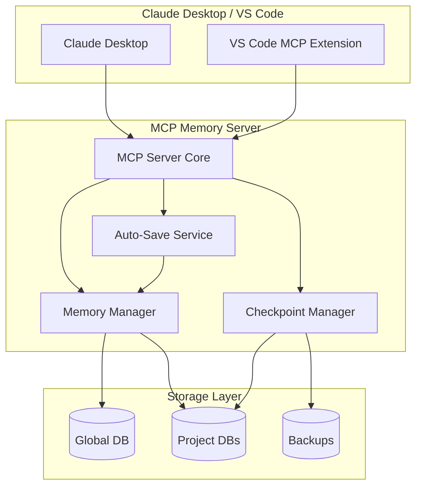
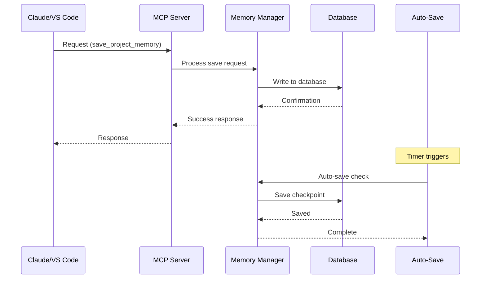
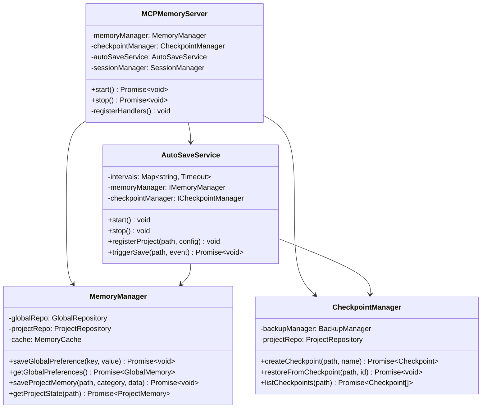

# MCP Memory Server Technical Design Document / MCPメモリサーバー技術設計書

## Table of Contents / 目次

1. [System Architecture / システムアーキテクチャ](#1-system-architecture--システムアーキテクチャ)
2. [Technology Stack Selection / 技術スタックの選択](#2-technology-stack-selection--技術スタックの選択)
3. [Module and Class Design / モジュールとクラス設計](#3-module-and-class-design--モジュールとクラス設計)
4. [Data Model and Database Schema / データモデルとデータベーススキーマ](#4-data-model-and-database-schema--データモデルとデータベーススキーマ)
5. [API Design and Integration Patterns / API設計と統合パターン](#5-api-design-and-integration-patterns--api設計と統合パターン)
6. [Security Architecture / セキュリティアーキテクチャ](#6-security-architecture--セキュリティアーキテクチャ)
7. [Performance and Scalability / パフォーマンスとスケーラビリティ](#7-performance-and-scalability--パフォーマンスとスケーラビリティ)
8. [Deployment Architecture / デプロイメントアーキテクチャ](#8-deployment-architecture--デプロイメントアーキテクチャ)

## 1. System Architecture / システムアーキテクチャ

### 1.1 High-Level Architecture / ハイレベルアーキテクチャ



### 1.2 Component Architecture / コンポーネントアーキテクチャ

```
┌─────────────────────────────────────────────────────────────┐
│                      MCP Client Layer                        │
│  ┌─────────────────┐         ┌──────────────────────────┐  │
│  │ Claude Desktop  │         │  VS Code MCP Extension   │  │
│  └────────┬────────┘         └────────────┬─────────────┘  │
└───────────┼───────────────────────────────┼─────────────────┘
            │          MCP Protocol         │
┌───────────┴───────────────────────────────┴─────────────────┐
│                    MCP Memory Server                         │
│  ┌─────────────────────────────────────────────────────┐   │
│  │                  MCP Server Core                     │   │
│  │  ┌─────────────┐  ┌──────────────┐  ┌───────────┐  │   │
│  │  │   Request   │  │   Response   │  │  Session  │  │   │
│  │  │   Handler   │  │   Builder    │  │  Manager  │  │   │
│  │  └──────┬──────┘  └──────┬───────┘  └─────┬─────┘  │   │
│  └─────────┼─────────────────┼────────────────┼────────┘   │
│            │                 │                 │             │
│  ┌─────────┴─────────────────┴────────────────┴────────┐   │
│  │                  Service Layer                       │   │
│  │  ┌──────────────┐  ┌─────────────┐  ┌────────────┐  │   │
│  │  │   Memory     │  │ Checkpoint  │  │ Auto-Save  │  │   │
│  │  │   Manager    │  │  Manager    │  │  Service   │  │   │
│  │  └──────┬───────┘  └──────┬──────┘  └─────┬──────┘  │   │
│  └─────────┼──────────────────┼───────────────┼────────┘   │
│            │                  │                │             │
│  ┌─────────┴──────────────────┴───────────────┴────────┐   │
│  │                 Data Access Layer                    │   │
│  │  ┌──────────────┐  ┌─────────────┐  ┌────────────┐  │   │
│  │  │  Global DB   │  │ Project DB  │  │  Backup    │  │   │
│  │  │  Repository  │  │ Repository  │  │  Manager   │  │   │
│  │  └──────┬───────┘  └──────┬──────┘  └─────┬──────┘  │   │
│  └─────────┼──────────────────┼───────────────┼────────┘   │
└────────────┼──────────────────┼───────────────┼────────────┘
             │                  │                │
┌────────────┴──────────────────┴───────────────┴────────────┐
│                      Storage Layer                          │
│  ┌──────────────┐  ┌─────────────────┐  ┌──────────────┐  │
│  │  Global.db   │  │ Project DBs     │  │   Backups    │  │
│  │   (SQLite)   │  │   (SQLite)      │  │  (Snapshots) │  │
│  └──────────────┘  └─────────────────┘  └──────────────┘  │
└─────────────────────────────────────────────────────────────┘
```

### 1.3 Data Flow / データフロー



## 2. Technology Stack Selection / 技術スタックの選択

### 2.1 Core Technologies / コア技術

| Component | Technology | Rationale / 選定理由 |
|-----------|------------|---------------------|
| Language | TypeScript | Type safety, MCP SDK support, excellent tooling / 型安全性、MCP SDKサポート、優れたツーリング |
| Runtime | Node.js 20+ | LTS support, native ESM, performance improvements / LTSサポート、ネイティブESM、パフォーマンス改善 |
| Database | SQLite | Lightweight, serverless, ACID compliant, perfect for local storage / 軽量、サーバーレス、ACID準拠、ローカルストレージに最適 |
| ORM | Drizzle ORM | TypeScript-first, lightweight, excellent SQLite support / TypeScriptファースト、軽量、優れたSQLiteサポート |
| Testing | Vitest | Fast, ESM native, Jest compatible / 高速、ESMネイティブ、Jest互換 |
| Build Tool | tsup | Zero-config bundler, fast builds / ゼロコンフィグバンドラー、高速ビルド |
| Logging | Pino | Fast JSON logger, structured logging / 高速JSONロガー、構造化ログ |
| Validation | Zod | Runtime type validation, schema inference / ランタイム型検証、スキーマ推論 |

### 2.2 Development Tools / 開発ツール

| Tool | Purpose | Rationale / 選定理由 |
|------|---------|---------------------|
| ESLint | Linting | Code quality, consistency / コード品質、一貫性 |
| Prettier | Formatting | Consistent code style / 一貫したコードスタイル |
| Husky | Git hooks | Pre-commit validation / コミット前検証 |
| Commitizen | Commit messages | Conventional commits / 規約に沿ったコミット |
| Changesets | Version management | Automated releases / 自動リリース |

## 3. Module and Class Design / モジュールとクラス設計

### 3.1 Core Module Structure / コアモジュール構造

```typescript
// src/server/MCPMemoryServer.ts
export class MCPMemoryServer {
  private memoryManager: MemoryManager;
  private checkpointManager: CheckpointManager;
  private autoSaveService: AutoSaveService;
  private sessionManager: SessionManager;

  constructor(config: ServerConfig) {
    this.initializeServices(config);
    this.registerHandlers();
  }

  async start(): Promise<void>;
  async stop(): Promise<void>;
  private registerHandlers(): void;
}
```

### 3.2 Memory Manager / メモリマネージャー

```typescript
// src/services/MemoryManager.ts
export interface IMemoryManager {
  // Global operations
  saveGlobalPreference(key: string, value: any): Promise<void>;
  getGlobalPreferences(): Promise<GlobalMemory>;
  
  // Project operations
  saveProjectMemory(projectPath: string, category: string, data: any): Promise<void>;
  getProjectState(projectPath: string): Promise<ProjectMemory>;
  clearProjectMemory(projectPath: string): Promise<void>;
  
  // Utility operations
  listProjects(): Promise<ProjectInfo[]>;
  exportMemory(format: ExportFormat): Promise<string>;
}

export class MemoryManager implements IMemoryManager {
  private globalRepo: GlobalRepository;
  private projectRepo: ProjectRepository;
  private cache: MemoryCache;

  constructor(
    globalRepo: GlobalRepository,
    projectRepo: ProjectRepository,
    cacheConfig?: CacheConfig
  ) {
    this.globalRepo = globalRepo;
    this.projectRepo = projectRepo;
    this.cache = new MemoryCache(cacheConfig);
  }

  // Implementation details...
}
```

### 3.3 Checkpoint Manager / チェックポイントマネージャー

```typescript
// src/services/CheckpointManager.ts
export interface ICheckpointManager {
  createCheckpoint(projectPath: string, name?: string): Promise<Checkpoint>;
  restoreFromCheckpoint(projectPath: string, checkpointId: string): Promise<void>;
  listCheckpoints(projectPath: string): Promise<Checkpoint[]>;
  deleteCheckpoint(projectPath: string, checkpointId: string): Promise<void>;
  autoCheckpoint(projectPath: string): Promise<void>;
}

export class CheckpointManager implements ICheckpointManager {
  private backupManager: BackupManager;
  private projectRepo: ProjectRepository;

  constructor(backupManager: BackupManager, projectRepo: ProjectRepository) {
    this.backupManager = backupManager;
    this.projectRepo = projectRepo;
  }

  async createCheckpoint(projectPath: string, name?: string): Promise<Checkpoint> {
    const projectData = await this.projectRepo.getProject(projectPath);
    const checkpoint = await this.backupManager.createBackup(projectData, name);
    return checkpoint;
  }

  // Implementation details...
}
```

### 3.4 Auto-Save Service / 自動保存サービス

```typescript
// src/services/AutoSaveService.ts
export interface IAutoSaveService {
  start(): void;
  stop(): void;
  registerProject(projectPath: string, config: AutoSaveConfig): void;
  unregisterProject(projectPath: string): void;
  triggerSave(projectPath: string, event: SaveEvent): Promise<void>;
}

export class AutoSaveService implements IAutoSaveService {
  private intervals: Map<string, NodeJS.Timeout>;
  private memoryManager: IMemoryManager;
  private checkpointManager: ICheckpointManager;

  constructor(
    memoryManager: IMemoryManager,
    checkpointManager: ICheckpointManager
  ) {
    this.intervals = new Map();
    this.memoryManager = memoryManager;
    this.checkpointManager = checkpointManager;
  }

  registerProject(projectPath: string, config: AutoSaveConfig): void {
    if (this.intervals.has(projectPath)) {
      this.unregisterProject(projectPath);
    }

    const interval = setInterval(
      () => this.performAutoSave(projectPath),
      config.interval * 60 * 1000 // Convert minutes to milliseconds
    );

    this.intervals.set(projectPath, interval);
  }

  private async performAutoSave(projectPath: string): Promise<void> {
    try {
      await this.checkpointManager.autoCheckpoint(projectPath);
      logger.info(`Auto-save completed for project: ${projectPath}`);
    } catch (error) {
      logger.error(`Auto-save failed for project: ${projectPath}`, error);
    }
  }

  // Implementation details...
}
```

### 3.5 Class Diagram / クラス図



## 4. Data Model and Database Schema / データモデルとデータベーススキーマ

### 4.1 Database Structure / データベース構造

#### Global Database Schema / グローバルデータベーススキーマ

```sql
-- Global preferences table
CREATE TABLE global_preferences (
    id INTEGER PRIMARY KEY AUTOINCREMENT,
    category VARCHAR(50) NOT NULL,
    key VARCHAR(100) NOT NULL,
    value TEXT NOT NULL,
    type VARCHAR(20) NOT NULL DEFAULT 'string',
    created_at TIMESTAMP DEFAULT CURRENT_TIMESTAMP,
    updated_at TIMESTAMP DEFAULT CURRENT_TIMESTAMP,
    UNIQUE(category, key)
);

-- Global settings metadata
CREATE TABLE global_metadata (
    id INTEGER PRIMARY KEY AUTOINCREMENT,
    version VARCHAR(20) NOT NULL,
    last_migration INTEGER DEFAULT 0,
    created_at TIMESTAMP DEFAULT CURRENT_TIMESTAMP,
    updated_at TIMESTAMP DEFAULT CURRENT_TIMESTAMP
);

-- Indexes for performance
CREATE INDEX idx_global_preferences_category ON global_preferences(category);
CREATE INDEX idx_global_preferences_key ON global_preferences(key);
```

#### Project Database Schema / プロジェクトデータベーススキーマ

```sql
-- Project information
CREATE TABLE project_info (
    id INTEGER PRIMARY KEY AUTOINCREMENT,
    project_path TEXT NOT NULL UNIQUE,
    project_name TEXT NOT NULL,
    created_at TIMESTAMP DEFAULT CURRENT_TIMESTAMP,
    last_accessed TIMESTAMP DEFAULT CURRENT_TIMESTAMP
);

-- Current issue tracking
CREATE TABLE current_issue (
    id INTEGER PRIMARY KEY AUTOINCREMENT,
    project_id INTEGER NOT NULL,
    issue_number INTEGER,
    title TEXT,
    requirements TEXT, -- JSON array
    design_decisions TEXT, -- JSON array
    created_at TIMESTAMP DEFAULT CURRENT_TIMESTAMP,
    updated_at TIMESTAMP DEFAULT CURRENT_TIMESTAMP,
    FOREIGN KEY (project_id) REFERENCES project_info(id)
);

-- Task management
CREATE TABLE tasks (
    id INTEGER PRIMARY KEY AUTOINCREMENT,
    project_id INTEGER NOT NULL,
    task_description TEXT NOT NULL,
    status VARCHAR(20) NOT NULL, -- 'pending', 'in_progress', 'completed'
    priority INTEGER DEFAULT 0,
    created_at TIMESTAMP DEFAULT CURRENT_TIMESTAMP,
    completed_at TIMESTAMP,
    FOREIGN KEY (project_id) REFERENCES project_info(id)
);

-- Checkpoints
CREATE TABLE checkpoints (
    id INTEGER PRIMARY KEY AUTOINCREMENT,
    project_id INTEGER NOT NULL,
    checkpoint_name TEXT,
    branch_name TEXT,
    last_command TEXT,
    next_action TEXT,
    snapshot_data TEXT, -- JSON blob of complete state
    created_at TIMESTAMP DEFAULT CURRENT_TIMESTAMP,
    FOREIGN KEY (project_id) REFERENCES project_info(id)
);

-- Session state
CREATE TABLE session_state (
    id INTEGER PRIMARY KEY AUTOINCREMENT,
    project_id INTEGER NOT NULL,
    current_task TEXT,
    branch TEXT,
    modified_files TEXT, -- JSON array
    last_checkpoint TIMESTAMP,
    updated_at TIMESTAMP DEFAULT CURRENT_TIMESTAMP,
    FOREIGN KEY (project_id) REFERENCES project_info(id)
);

-- Indexes
CREATE INDEX idx_tasks_project_status ON tasks(project_id, status);
CREATE INDEX idx_checkpoints_project ON checkpoints(project_id);
CREATE INDEX idx_session_state_project ON session_state(project_id);
```

### 4.2 Data Models / データモデル

```typescript
// src/models/GlobalMemory.ts
export interface GlobalMemory {
  user_preferences: UserPreferences;
  development_style: DevelopmentStyle;
  communication_style: CommunicationStyle;
}

export interface UserPreferences {
  language: string;
  commit_style: string;
  package_manager: string;
  container: string;
  test_coverage: string;
}

export interface DevelopmentStyle {
  branch_strategy: string;
  pr_target: string;
  testing: string;
  linting: string;
}

export interface CommunicationStyle {
  response: string;
  explanation: string;
  error_handling: string;
}

// src/models/ProjectMemory.ts
export interface ProjectMemory {
  path: string;
  current_issue: IssueContext;
  tasks: TaskList;
  checkpoint: CheckpointInfo;
  session: SessionState;
}

export interface IssueContext {
  number: number;
  title: string;
  requirements: string[];
  design_decisions: string[];
}

export interface TaskList {
  completed: Task[];
  in_progress: Task | null;
  pending: Task[];
}

export interface Task {
  id: string;
  description: string;
  status: 'pending' | 'in_progress' | 'completed';
  priority: number;
  created_at: Date;
  completed_at?: Date;
}

export interface CheckpointInfo {
  id: string;
  name?: string;
  timestamp: Date;
  branch: string;
  last_command: string;
  next_action: string;
}

export interface SessionState {
  current_task: string;
  branch: string;
  modified_files: string[];
  last_checkpoint: Date;
}
```

### 4.3 Data Access Layer / データアクセス層

```typescript
// src/repositories/BaseRepository.ts
export abstract class BaseRepository<T> {
  protected db: Database;

  constructor(db: Database) {
    this.db = db;
  }

  abstract create(data: Partial<T>): Promise<T>;
  abstract findById(id: string | number): Promise<T | null>;
  abstract update(id: string | number, data: Partial<T>): Promise<T>;
  abstract delete(id: string | number): Promise<void>;
}

// src/repositories/GlobalRepository.ts
export class GlobalRepository extends BaseRepository<GlobalPreference> {
  async savePreference(category: string, key: string, value: any): Promise<void> {
    const serialized = JSON.stringify(value);
    await this.db.run(
      `INSERT OR REPLACE INTO global_preferences (category, key, value, type)
       VALUES (?, ?, ?, ?)`,
      [category, key, serialized, typeof value]
    );
  }

  async getPreferences(): Promise<GlobalMemory> {
    const rows = await this.db.all(
      `SELECT category, key, value, type FROM global_preferences`
    );
    
    return this.reconstructGlobalMemory(rows);
  }

  private reconstructGlobalMemory(rows: any[]): GlobalMemory {
    const memory: any = {
      user_preferences: {},
      development_style: {},
      communication_style: {}
    };

    rows.forEach(row => {
      const value = row.type === 'object' ? JSON.parse(row.value) : row.value;
      memory[row.category][row.key] = value;
    });

    return memory as GlobalMemory;
  }
}
```

## 5. API Design and Integration Patterns / API設計と統合パターン

### 5.1 MCP Protocol Implementation / MCPプロトコル実装

```typescript
// src/api/handlers.ts
export const handlers: MCPHandlers = {
  // Global preference operations
  'memory/save_global_preference': async (params: SaveGlobalPreferenceParams) => {
    const { key, value } = validateParams(saveGlobalPreferenceSchema, params);
    await memoryManager.saveGlobalPreference(key, value);
    return { success: true };
  },

  'memory/get_global_preferences': async () => {
    const preferences = await memoryManager.getGlobalPreferences();
    return { preferences };
  },

  // Project memory operations
  'memory/save_project_memory': async (params: SaveProjectMemoryParams) => {
    const { project_path, category, data } = validateParams(saveProjectMemorySchema, params);
    await memoryManager.saveProjectMemory(project_path, category, data);
    return { success: true };
  },

  'memory/get_project_state': async (params: GetProjectStateParams) => {
    const { project_path } = validateParams(getProjectStateSchema, params);
    const state = await memoryManager.getProjectState(project_path);
    return { state };
  },

  // Checkpoint operations
  'memory/create_checkpoint': async (params: CreateCheckpointParams) => {
    const { project_path, name } = validateParams(createCheckpointSchema, params);
    const checkpoint = await checkpointManager.createCheckpoint(project_path, name);
    return { checkpoint };
  },

  'memory/restore_from_checkpoint': async (params: RestoreCheckpointParams) => {
    const { project_path, checkpoint_id } = validateParams(restoreCheckpointSchema, params);
    await checkpointManager.restoreFromCheckpoint(project_path, checkpoint_id);
    return { success: true };
  },

  // Management operations
  'memory/list_projects': async () => {
    const projects = await memoryManager.listProjects();
    return { projects };
  },

  'memory/clear_project_memory': async (params: ClearProjectMemoryParams) => {
    const { project_path } = validateParams(clearProjectMemorySchema, params);
    await memoryManager.clearProjectMemory(project_path);
    return { success: true };
  },

  'memory/export_memory': async (params: ExportMemoryParams) => {
    const { format } = validateParams(exportMemorySchema, params);
    const exported = await memoryManager.exportMemory(format);
    return { data: exported };
  }
};
```

### 5.2 Request/Response Schemas / リクエスト/レスポンススキーマ

```typescript
// src/schemas/api.ts
import { z } from 'zod';

// Request schemas
export const saveGlobalPreferenceSchema = z.object({
  key: z.string().min(1),
  value: z.any()
});

export const saveProjectMemorySchema = z.object({
  project_path: z.string().min(1),
  category: z.enum(['issue', 'tasks', 'session', 'checkpoint']),
  data: z.any()
});

export const getProjectStateSchema = z.object({
  project_path: z.string().min(1)
});

export const createCheckpointSchema = z.object({
  project_path: z.string().min(1),
  name: z.string().optional()
});

export const restoreCheckpointSchema = z.object({
  project_path: z.string().min(1),
  checkpoint_id: z.string().min(1)
});

export const clearProjectMemorySchema = z.object({
  project_path: z.string().min(1)
});

export const exportMemorySchema = z.object({
  format: z.enum(['json', 'yaml'])
});

// Response types
export interface APIResponse<T = any> {
  success: boolean;
  data?: T;
  error?: {
    code: string;
    message: string;
    details?: any;
  };
}
```

### 5.3 Integration Patterns / 統合パターン

```typescript
// src/integration/MCPClient.ts
export class MCPMemoryClient {
  private transport: Transport;

  constructor(transport: Transport) {
    this.transport = transport;
  }

  // Convenience methods for common operations
  async saveGlobalPreference(key: string, value: any): Promise<void> {
    await this.transport.request('memory/save_global_preference', { key, value });
  }

  async getGlobalPreferences(): Promise<GlobalMemory> {
    const response = await this.transport.request('memory/get_global_preferences');
    return response.preferences;
  }

  async saveProjectContext(projectPath: string, context: ProjectContext): Promise<void> {
    await Promise.all([
      this.transport.request('memory/save_project_memory', {
        project_path: projectPath,
        category: 'issue',
        data: context.issue
      }),
      this.transport.request('memory/save_project_memory', {
        project_path: projectPath,
        category: 'tasks',
        data: context.tasks
      })
    ]);
  }

  async createCheckpoint(projectPath: string, name?: string): Promise<Checkpoint> {
    const response = await this.transport.request('memory/create_checkpoint', {
      project_path: projectPath,
      name
    });
    return response.checkpoint;
  }
}
```

## 6. Security Architecture / セキュリティアーキテクチャ

### 6.1 Security Layers / セキュリティレイヤー

```
┌─────────────────────────────────────────────────────────┐
│                   Access Control                         │
│  - Local process only (no network exposure)             │
│  - File system permissions                              │
│  - Process isolation                                    │
└─────────────────────────────────────────────────────────┘
                            │
┌─────────────────────────────────────────────────────────┐
│                  Data Protection                         │
│  - Optional encryption at rest                          │
│  - Secure key storage                                   │
│  - Data sanitization                                    │
└─────────────────────────────────────────────────────────┘
                            │
┌─────────────────────────────────────────────────────────┐
│                 Input Validation                         │
│  - Schema validation (Zod)                              │
│  - SQL injection prevention                             │
│  - Path traversal protection                            │
└─────────────────────────────────────────────────────────┘
```

### 6.2 Security Implementation / セキュリティ実装

```typescript
// src/security/encryption.ts
export class EncryptionService {
  private algorithm = 'aes-256-gcm';
  private keyDerivation = 'scrypt';

  async encrypt(data: string, password?: string): Promise<EncryptedData> {
    if (!password) {
      // Use system-derived key if no password provided
      password = await this.getSystemKey();
    }

    const salt = crypto.randomBytes(32);
    const key = await this.deriveKey(password, salt);
    const iv = crypto.randomBytes(16);
    
    const cipher = crypto.createCipheriv(this.algorithm, key, iv);
    const encrypted = Buffer.concat([
      cipher.update(data, 'utf8'),
      cipher.final()
    ]);
    
    const tag = cipher.getAuthTag();

    return {
      encrypted: encrypted.toString('base64'),
      salt: salt.toString('base64'),
      iv: iv.toString('base64'),
      tag: tag.toString('base64')
    };
  }

  async decrypt(encryptedData: EncryptedData, password?: string): Promise<string> {
    if (!password) {
      password = await this.getSystemKey();
    }

    const salt = Buffer.from(encryptedData.salt, 'base64');
    const key = await this.deriveKey(password, salt);
    const iv = Buffer.from(encryptedData.iv, 'base64');
    const tag = Buffer.from(encryptedData.tag, 'base64');
    const encrypted = Buffer.from(encryptedData.encrypted, 'base64');

    const decipher = crypto.createDecipheriv(this.algorithm, key, iv);
    decipher.setAuthTag(tag);

    const decrypted = Buffer.concat([
      decipher.update(encrypted),
      decipher.final()
    ]);

    return decrypted.toString('utf8');
  }

  private async deriveKey(password: string, salt: Buffer): Promise<Buffer> {
    return new Promise((resolve, reject) => {
      crypto.scrypt(password, salt, 32, (err, derivedKey) => {
        if (err) reject(err);
        else resolve(derivedKey);
      });
    });
  }

  private async getSystemKey(): Promise<string> {
    // Derive key from system-specific attributes
    const systemInfo = {
      platform: process.platform,
      arch: process.arch,
      user: os.userInfo().username,
      hostname: os.hostname()
    };
    
    return crypto
      .createHash('sha256')
      .update(JSON.stringify(systemInfo))
      .digest('hex');
  }
}
```

### 6.3 Access Control / アクセス制御

```typescript
// src/security/access.ts
export class AccessControl {
  private dbPath: string;
  private allowedPaths: Set<string>;

  constructor(config: AccessControlConfig) {
    this.dbPath = config.dbPath;
    this.allowedPaths = new Set(config.allowedPaths);
  }

  validatePath(requestedPath: string): void {
    const normalized = path.normalize(requestedPath);
    const resolved = path.resolve(normalized);

    // Prevent path traversal
    if (normalized.includes('..') || !resolved.startsWith(process.cwd())) {
      throw new SecurityError('Invalid path: potential path traversal detected');
    }

    // Check if path is in allowed list
    if (!this.isPathAllowed(resolved)) {
      throw new SecurityError('Access denied: path not in allowed list');
    }
  }

  private isPathAllowed(requestedPath: string): boolean {
    return Array.from(this.allowedPaths).some(allowed => 
      requestedPath.startsWith(path.resolve(allowed))
    );
  }

  ensureFilePermissions(filePath: string): void {
    try {
      // Set restrictive permissions (owner read/write only)
      fs.chmodSync(filePath, 0o600);
    } catch (error) {
      throw new SecurityError(`Failed to set file permissions: ${error.message}`);
    }
  }
}
```

## 7. Performance and Scalability / パフォーマンスとスケーラビリティ

### 7.1 Performance Optimizations / パフォーマンス最適化

#### Caching Strategy / キャッシング戦略

```typescript
// src/cache/MemoryCache.ts
export class MemoryCache {
  private cache: LRUCache<string, any>;
  private hitRate: number = 0;
  private requests: number = 0;

  constructor(config: CacheConfig = {}) {
    this.cache = new LRUCache({
      max: config.maxSize || 100,
      ttl: config.ttl || 1000 * 60 * 5, // 5 minutes default
      updateAgeOnGet: true,
      updateAgeOnHas: true
    });
  }

  async get<T>(key: string, factory: () => Promise<T>): Promise<T> {
    this.requests++;
    
    if (this.cache.has(key)) {
      this.hitRate = ((this.hitRate * (this.requests - 1)) + 1) / this.requests;
      return this.cache.get(key) as T;
    }

    const value = await factory();
    this.cache.set(key, value);
    this.hitRate = (this.hitRate * (this.requests - 1)) / this.requests;
    
    return value;
  }

  invalidate(pattern?: string): void {
    if (!pattern) {
      this.cache.clear();
      return;
    }

    const regex = new RegExp(pattern);
    for (const key of this.cache.keys()) {
      if (regex.test(key)) {
        this.cache.delete(key);
      }
    }
  }

  getStats(): CacheStats {
    return {
      size: this.cache.size,
      maxSize: this.cache.max,
      hitRate: this.hitRate,
      requests: this.requests
    };
  }
}
```

#### Database Optimizations / データベース最適化

```typescript
// src/db/optimizations.ts
export class DatabaseOptimizer {
  async optimizeDatabase(db: Database): Promise<void> {
    // Enable WAL mode for better concurrency
    await db.run('PRAGMA journal_mode = WAL');
    
    // Optimize SQLite settings
    await db.run('PRAGMA synchronous = NORMAL');
    await db.run('PRAGMA cache_size = -64000'); // 64MB cache
    await db.run('PRAGMA temp_store = MEMORY');
    await db.run('PRAGMA mmap_size = 268435456'); // 256MB memory-mapped I/O
    
    // Analyze tables for query optimization
    await db.run('ANALYZE');
  }

  async vacuum(db: Database): Promise<void> {
    await db.run('VACUUM');
  }

  async createIndexes(db: Database): Promise<void> {
    const indexes = [
      'CREATE INDEX IF NOT EXISTS idx_tasks_status_priority ON tasks(status, priority)',
      'CREATE INDEX IF NOT EXISTS idx_checkpoints_created_at ON checkpoints(created_at)',
      'CREATE INDEX IF NOT EXISTS idx_session_updated_at ON session_state(updated_at)'
    ];

    for (const index of indexes) {
      await db.run(index);
    }
  }
}
```

### 7.2 Scalability Considerations / スケーラビリティの考慮事項

#### Project Sharding / プロジェクトシャーディング

```typescript
// src/sharding/ProjectSharding.ts
export class ProjectSharding {
  private shardCount: number;
  private shardPath: string;

  constructor(config: ShardingConfig) {
    this.shardCount = config.shardCount || 16;
    this.shardPath = config.shardPath;
  }

  getShardForProject(projectPath: string): string {
    const hash = crypto.createHash('md5').update(projectPath).digest('hex');
    const shardId = parseInt(hash.substring(0, 2), 16) % this.shardCount;
    
    return path.join(this.shardPath, `shard_${shardId}`, `${hash}.db`);
  }

  async distributeProjects(): Promise<ShardDistribution> {
    const distribution: ShardDistribution = {};
    
    for (let i = 0; i < this.shardCount; i++) {
      const shardDir = path.join(this.shardPath, `shard_${i}`);
      await fs.mkdir(shardDir, { recursive: true });
      
      const files = await fs.readdir(shardDir);
      distribution[`shard_${i}`] = files.length;
    }

    return distribution;
  }
}
```

#### Connection Pooling / コネクションプーリング

```typescript
// src/db/ConnectionPool.ts
export class ConnectionPool {
  private pools: Map<string, Database[]>;
  private config: PoolConfig;

  constructor(config: PoolConfig) {
    this.pools = new Map();
    this.config = config;
  }

  async getConnection(dbPath: string): Promise<PooledConnection> {
    if (!this.pools.has(dbPath)) {
      await this.createPool(dbPath);
    }

    const pool = this.pools.get(dbPath)!;
    const connection = pool.pop();

    if (!connection) {
      // All connections busy, create a new one
      return this.createConnection(dbPath);
    }

    return new PooledConnection(connection, () => {
      pool.push(connection);
    });
  }

  private async createPool(dbPath: string): Promise<void> {
    const pool: Database[] = [];
    
    for (let i = 0; i < this.config.minConnections; i++) {
      const db = await this.createConnection(dbPath);
      pool.push(db);
    }

    this.pools.set(dbPath, pool);
  }

  private async createConnection(dbPath: string): Promise<Database> {
    const db = new Database(dbPath);
    await new DatabaseOptimizer().optimizeDatabase(db);
    return db;
  }
}
```

### 7.3 Performance Metrics / パフォーマンスメトリクス

```typescript
// src/monitoring/PerformanceMonitor.ts
export class PerformanceMonitor {
  private metrics: Map<string, Metric>;

  constructor() {
    this.metrics = new Map();
  }

  startTimer(operation: string): () => void {
    const start = process.hrtime.bigint();
    
    return () => {
      const end = process.hrtime.bigint();
      const duration = Number(end - start) / 1_000_000; // Convert to milliseconds
      
      this.recordMetric(operation, duration);
    };
  }

  recordMetric(operation: string, value: number): void {
    if (!this.metrics.has(operation)) {
      this.metrics.set(operation, {
        count: 0,
        total: 0,
        min: Infinity,
        max: -Infinity,
        avg: 0
      });
    }

    const metric = this.metrics.get(operation)!;
    metric.count++;
    metric.total += value;
    metric.min = Math.min(metric.min, value);
    metric.max = Math.max(metric.max, value);
    metric.avg = metric.total / metric.count;
  }

  getReport(): PerformanceReport {
    const report: PerformanceReport = {};
    
    for (const [operation, metric] of this.metrics) {
      report[operation] = {
        count: metric.count,
        avgDuration: metric.avg,
        minDuration: metric.min,
        maxDuration: metric.max
      };
    }

    return report;
  }
}
```

## 8. Deployment Architecture / デプロイメントアーキテクチャ

### 8.1 Directory Structure / ディレクトリ構造

```
mcp-memory-server/
├── src/
│   ├── server/
│   │   ├── MCPMemoryServer.ts
│   │   └── index.ts
│   ├── services/
│   │   ├── MemoryManager.ts
│   │   ├── CheckpointManager.ts
│   │   └── AutoSaveService.ts
│   ├── repositories/
│   │   ├── BaseRepository.ts
│   │   ├── GlobalRepository.ts
│   │   └── ProjectRepository.ts
│   ├── models/
│   │   ├── GlobalMemory.ts
│   │   ├── ProjectMemory.ts
│   │   └── Checkpoint.ts
│   ├── api/
│   │   ├── handlers.ts
│   │   └── middleware.ts
│   ├── db/
│   │   ├── migrations/
│   │   ├── DatabaseManager.ts
│   │   └── ConnectionPool.ts
│   ├── cache/
│   │   └── MemoryCache.ts
│   ├── security/
│   │   ├── encryption.ts
│   │   └── access.ts
│   ├── utils/
│   │   ├── logger.ts
│   │   └── validators.ts
│   └── types/
│       └── index.d.ts
├── tests/
│   ├── unit/
│   ├── integration/
│   └── e2e/
├── config/
│   ├── default.json
│   ├── development.json
│   └── production.json
├── scripts/
│   ├── setup.ts
│   ├── migrate.ts
│   └── backup.ts
├── docs/
│   ├── API.md
│   ├── ARCHITECTURE.md
│   └── DEPLOYMENT.md
├── package.json
├── tsconfig.json
├── .env.example
└── README.md
```

### 8.2 Installation and Setup / インストールとセットアップ

```bash
#!/bin/bash
# scripts/install.sh

# Create MCP memory directory structure
MCP_DIR="$HOME/.claude/mcp-memory"
mkdir -p "$MCP_DIR"/{global,projects,backups,logs}

# Set appropriate permissions
chmod 700 "$MCP_DIR"
chmod 700 "$MCP_DIR"/*

# Initialize databases
npm run migrate

# Create default configuration
cp config/default.json "$MCP_DIR/config.json"

# Register with Claude Desktop
echo "Adding MCP server to Claude Desktop configuration..."
node scripts/register-mcp.js
```

### 8.3 Configuration Management / 設定管理

```json
// config/default.json
{
  "server": {
    "name": "mcp-memory-server",
    "version": "1.0.0",
    "protocol": "mcp"
  },
  "storage": {
    "basePath": "~/.claude/mcp-memory",
    "databases": {
      "global": "global.db",
      "projects": "projects"
    },
    "backups": {
      "enabled": true,
      "retention": 7,
      "schedule": "0 2 * * *"
    }
  },
  "performance": {
    "cache": {
      "enabled": true,
      "maxSize": 100,
      "ttl": 300000
    },
    "database": {
      "connectionPool": {
        "min": 2,
        "max": 10
      },
      "optimization": true
    }
  },
  "security": {
    "encryption": {
      "enabled": false,
      "algorithm": "aes-256-gcm"
    },
    "accessControl": {
      "enabled": true,
      "allowedPaths": ["~/projects", "~/dev"]
    }
  },
  "autoSave": {
    "enabled": true,
    "interval": 30,
    "triggers": ["task_complete", "test_pass"]
  },
  "logging": {
    "level": "info",
    "file": "logs/mcp-memory.log",
    "maxSize": "10m",
    "maxFiles": 5
  }
}
```

### 8.4 Claude Desktop Integration / Claude Desktop統合

```json
// Claude Desktop configuration
{
  "mcpServers": {
    "memory": {
      "command": "node",
      "args": ["~/.claude/mcp-memory/dist/index.js"],
      "env": {
        "NODE_ENV": "production",
        "MCP_MEMORY_CONFIG": "~/.claude/mcp-memory/config.json"
      }
    }
  }
}
```

### 8.5 Monitoring and Maintenance / 監視とメンテナンス

```typescript
// src/maintenance/HealthCheck.ts
export class HealthCheck {
  private services: Map<string, IHealthCheckable>;

  constructor() {
    this.services = new Map();
  }

  register(name: string, service: IHealthCheckable): void {
    this.services.set(name, service);
  }

  async checkHealth(): Promise<HealthReport> {
    const report: HealthReport = {
      status: 'healthy',
      timestamp: new Date(),
      services: {}
    };

    for (const [name, service] of this.services) {
      try {
        const health = await service.checkHealth();
        report.services[name] = health;
        
        if (health.status !== 'healthy') {
          report.status = 'degraded';
        }
      } catch (error) {
        report.services[name] = {
          status: 'unhealthy',
          error: error.message
        };
        report.status = 'unhealthy';
      }
    }

    return report;
  }
}

// Maintenance tasks
export class MaintenanceTasks {
  async performDailyMaintenance(): Promise<void> {
    logger.info('Starting daily maintenance');
    
    // 1. Backup databases
    await this.backupDatabases();
    
    // 2. Clean old checkpoints
    await this.cleanOldCheckpoints();
    
    // 3. Optimize databases
    await this.optimizeDatabases();
    
    // 4. Rotate logs
    await this.rotateLogs();
    
    logger.info('Daily maintenance completed');
  }

  private async cleanOldCheckpoints(): Promise<void> {
    const retentionDays = config.get('storage.backups.retention');
    const cutoffDate = new Date();
    cutoffDate.setDate(cutoffDate.getDate() - retentionDays);

    // Implementation for cleaning old checkpoints
  }
}
```

### 8.6 Disaster Recovery / 災害復旧

```typescript
// src/backup/BackupManager.ts
export class BackupManager {
  async createBackup(data: any, name?: string): Promise<Backup> {
    const timestamp = new Date().toISOString();
    const backupId = crypto.randomUUID();
    const backupName = name || `backup_${timestamp}`;
    
    const backup: Backup = {
      id: backupId,
      name: backupName,
      timestamp,
      data: JSON.stringify(data),
      checksum: this.calculateChecksum(data)
    };

    await this.saveBackup(backup);
    return backup;
  }

  async restoreBackup(backupId: string): Promise<any> {
    const backup = await this.loadBackup(backupId);
    
    // Verify checksum
    const data = JSON.parse(backup.data);
    const checksum = this.calculateChecksum(data);
    
    if (checksum !== backup.checksum) {
      throw new Error('Backup integrity check failed');
    }

    return data;
  }

  private calculateChecksum(data: any): string {
    return crypto
      .createHash('sha256')
      .update(JSON.stringify(data))
      .digest('hex');
  }
}
```

## Summary / まとめ

This technical design document provides a comprehensive blueprint for implementing the MCP Memory Server. The architecture emphasizes:

1. **Modularity**: Clear separation of concerns with well-defined interfaces
2. **Performance**: Caching, connection pooling, and database optimizations
3. **Security**: Local-only access, optional encryption, input validation
4. **Reliability**: Automated backups, health checks, disaster recovery
5. **Maintainability**: Clear structure, comprehensive logging, monitoring

The implementation follows TypeScript best practices and leverages modern tools and patterns to ensure a robust, scalable solution for managing Claude Code's memory across development sessions.

このテクニカルデザインドキュメントは、MCPメモリサーバーの実装のための包括的な設計図を提供します。アーキテクチャは以下を重視しています：

1. **モジュール性**: 明確に定義されたインターフェースによる関心の分離
2. **パフォーマンス**: キャッシング、コネクションプーリング、データベース最適化
3. **セキュリティ**: ローカルのみのアクセス、オプションの暗号化、入力検証
4. **信頼性**: 自動バックアップ、ヘルスチェック、災害復旧
5. **保守性**: 明確な構造、包括的なロギング、監視

実装はTypeScriptのベストプラクティスに従い、現代的なツールとパターンを活用して、開発セッション全体でClaude Codeのメモリを管理するための堅牢でスケーラブルなソリューションを保証します。