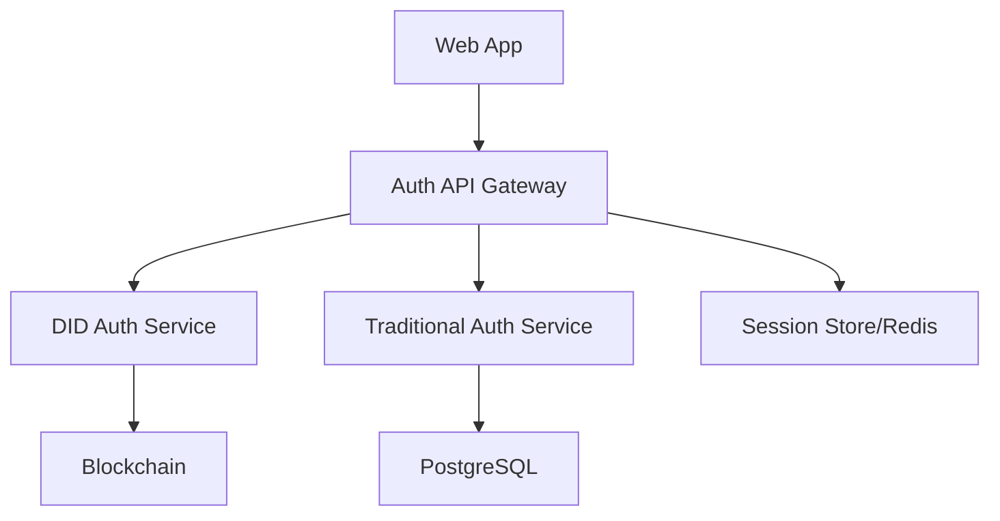

# ユーザー認証機能 - 設計書

## アーキテクチャ概要



## API設計

### エンドポイント

#### DID認証
```
POST /api/auth/did/challenge
GET  /api/auth/did/verify
POST /api/auth/did/login
```

#### 従来型認証
```
POST /api/auth/register
POST /api/auth/login
POST /api/auth/logout
POST /api/auth/refresh
```

## データベース設計

### Users Table
```sql
CREATE TABLE users (
    id UUID PRIMARY KEY,
    did VARCHAR(255) UNIQUE,
    email VARCHAR(255) UNIQUE,
    password_hash VARCHAR(255),
    created_at TIMESTAMP,
    updated_at TIMESTAMP
);
```

### Sessions Table
```sql
CREATE TABLE sessions (
    id UUID PRIMARY KEY,
    user_id UUID REFERENCES users(id),
    token VARCHAR(512) UNIQUE,
    expires_at TIMESTAMP,
    created_at TIMESTAMP
);
```

## セキュリティ設計

- JWT署名アルゴリズム: RS256
- トークン有効期限: アクセストークン15分、リフレッシュトークン7日
- パスワードハッシュ: bcrypt (cost factor: 12)